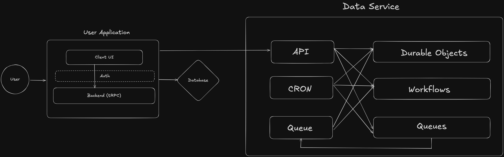

# Introduction

In this SaaS, I'm going to use a monorepo to handler scale. The time taken for initial scaffolding of the monorepo is later going to be worth it for the future ease of development.

# Packages

Packages are self contained projects living in a single repository to enable code sharing, modularity, and streamlined management.

## Data-ops Package

This is a shared data package for data helper functions.

It is going to handle:

- Schema Management
- Database Queries
- Types & Schemas
- Code that can reused by both the frontend and backend/workers.

### Tech Stack

- Drizzle ORM: Managing database connections, migrations and interactions.
- Zod: Schema and data validation.
- PNPM Workspace: To manage multiple packages and provide support for additional packages.

# Services

Services are individual applications that are also self-contained but also deployable application component. It is a distinct application with it's own lifecycle, environment and resources.

In this SaaS, I'm going to use 2 services:

- User application
- Data Service

## User Application Service

User application service is going to be responsible for handling our frontend application.

It is going to handle:

- Routing
- Authentication & Payments
- Basic CRUD patterns

### Tech Stack

- React: Component based design and dynamic UI.
- Tanstack Query: Used for data fetching, caching, synchronization and seamless updates.
- Tanstack Router: Managing client-side navigation with build in type-safety and data loading.
- Shadcn/UI: Pre-written components for custom design.
- tRPC: Makes parsing and protecting the API endpoints easy.
- Hono: Handle server routing and serving API endpoints and static assets.

## Data Service Layer

Data Service layer is going to perform compute heavy tasks such as background jobs, long-running tasks, and smart logic.

It is going to handle:

- Data Processing
- Long Running Tasks
- Link Redirection
- Browser Rendering
- AI Inference
- Websockets

### Tech Stack

- Hono: Compute heavy processing.
- Queues: Asynchronous message processing.
- Durable Objects: Managing scheduling and websockets.
- Workflows: Running sequential jobs that require multiple steps.
